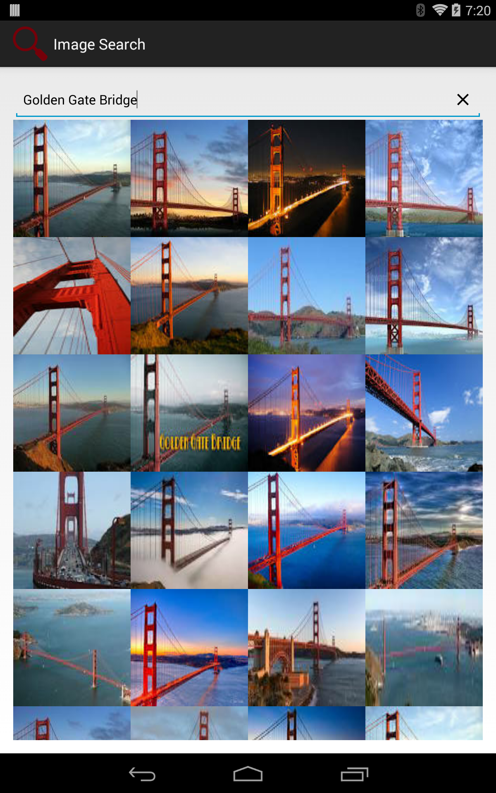
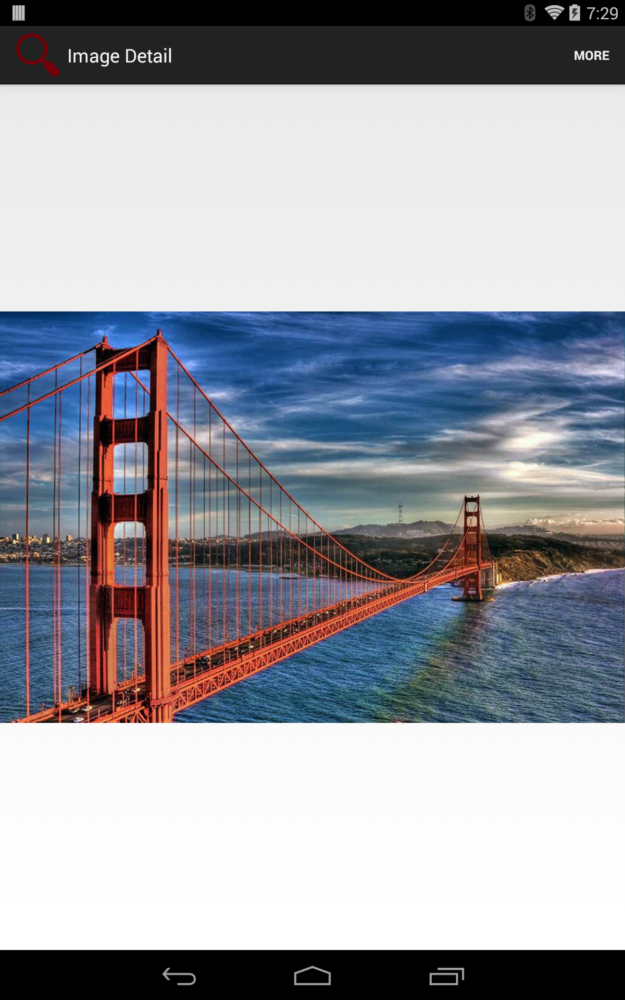
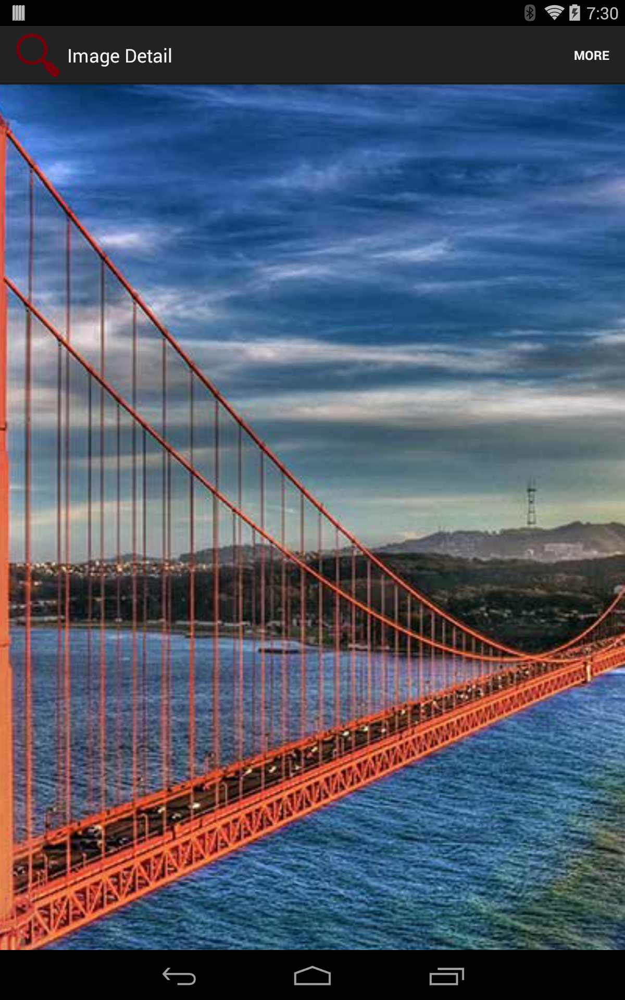

ImageSearch
===========
An image search app for Android.

Displays a grid of image thumbnails in response to a keyword search. Search results are provided by the Google Custom Search API.

Thumbnails may be tapped to display a view of the full image with pinch-to-zoom.

Design Notes
------------
- Search requests are sent when the user stops typing, after a short delay (900 ms)
- For a tablet-friendly UI, the number of thumbnail columns is determined at runtime depending on screen size
- The "X" in the EditText is a feature that's nonstandard on Android, but useful for clearing the contents of the text field
- For the full-image view, small images are scaled up to fill the screen, and large images are scaled down to fit on the screen
- A "More" option allows the user to launch the browser with the page the image was indexed on

Third-party libraries used (Apache 2.0 licensed):
-------------------------------------------------
- [DroidParts](https://github.com/yanchenko/droidparts) (for the clearable EditText)
- [Gson](https://code.google.com/p/google-gson/) (for Json deserialization)
- [ImageViewTouch](https://github.com/sephiroth74/ImageViewZoom)  (for pinch-to-zoom)
- [Picasso](https://github.com/square/picasso) (for image loading and caching)
- [Volley](https://android.googlesource.com/platform/frameworks/volley/) (for network requests and responses)

Known Issues
------------
The Google Custom Search API intermittently returns HTTP status code 403 responses. This appears to happen in response to the number and frequency of requests made.

This behavior has also been [documented by others](https://groups.google.com/forum/#!topic/Google-Ajax-Search-API/_6QxPgEiajk).

Screenshots
-----------

